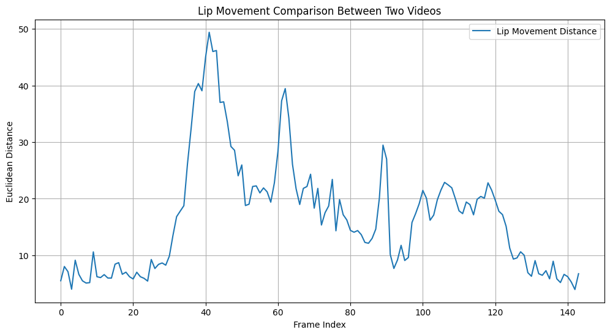
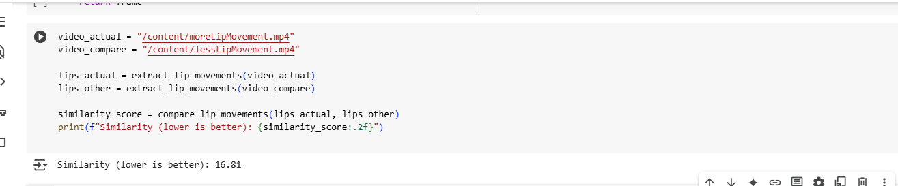

# DevNetworkHackathon
This repository contains my attempt for DevNetwork hackathon.

The project contains three steps - 

🔹 Speech Therapy – Lip Movement Analysis
In traditional speech therapy, children are guided to pronounce specific words or phrases, while therapists observe and evaluate their articulation. To digitize this process:

Developed a system to compare a reference video (recorded by a parent or therapist) with the child’s attempt to repeat the word.

Integrated the shape_predictor_68_face_landmarks.dat model to accurately track facial landmarks and analyze lip movements.

Used Euclidean distance to measure the variation in lip positions across video frames, thereby quantifying pronunciation accuracy.

Visualized the comparison with side-by-side video playback and dynamic graphs with score to detect even minor articulation 
differences.

1) Comparsion graph between lip distance for both videos

2) Similarity score between lip movement of two videos 
 

3) Comparison video
[Watch Demo Video](LipMovementComparison/output_combinedVideo.avi)

🔹 Motor Therapy – Pose Estimation
Motor therapy often involves mimicking physical activities demonstrated by a therapist. My solution automates this assessment:

Utilized Detectron2’s Mask R-CNN to perform pose estimation and identify key body joints.

Recorded and compared the child’s actions with ideal movement references.

Calculated similarity scores to quantify motion accuracy.

Presented results using video overlays and visual graphs, enabling therapists to assess how well the child replicates movements.

🔹 Interpretation Therapy – Visual Understanding through Drawing

Many children with developmental disorders struggle with connecting words to visuals. This module evaluates their ability to interpret verbal prompts:

Used the QuickDraw dataset and Python API to simulate real-time drawing tasks.

Displayed a simple word prompt (e.g., “cat”) and prompted the child to draw the object.

Compared the child’s drawing to multiple reference samples from QuickDraw.

Measured semantic alignment between the prompt and drawing, offering insight into cognitive and interpretive skills.

The demo of the video is over here - https://www.youtube.com/watch?feature=shared&v=BwIYqOn4sgs
